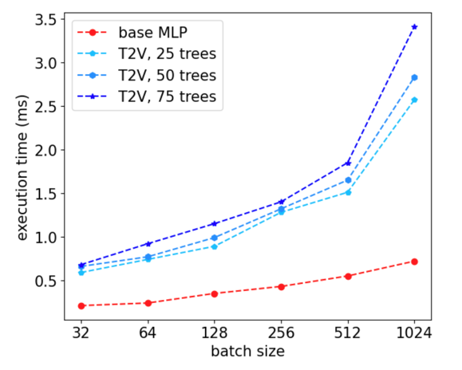

# Tree-Regularized Tabular Embeddings

This repository is the official implementation of [Tree-Regularized Tabular Embeddings](https://openreview.net/forum?id=dQLDxIPsU4), which utilizes the structure of pretrained tree ensembles to transform raw variables into a single vector (T2V), or an array of tokens (T2T). In essence,the transformed representations can be directly consumed by advanced tabular NN models with multi-layered perception (MLP) or multi-head attention (MHA) as building blocks. 

<p align="center">
  
<br>
<em>
An overview of T2T, where the embeddings are generated through level-order traversal over tree with padding 
</em>
</p>


## Implementation 
We employ the transformation within each mini-batch to make it scalable for large tabular datasets with hundreds of columns and million of rows. For example, 

```python 
for _, (x, y) in enumerate(data_loader):
    x = transform_batch(x) 
    y_pred = model(x)
    ...
```

Essentially, it makes a trade-off between time and space complexity, and scales well with respect to the number of tree ensembles

<p align="center">
  
<br>
<em>
A comparison of forward-pass wall time between T2V with MLP and vanilla MLP.
</em>
</p>


## Code 
A sample execuation is provided in `sample.py`, where the two transformations are specified by 'tree-to-vector' and 'tree-to-token' respectively. 
