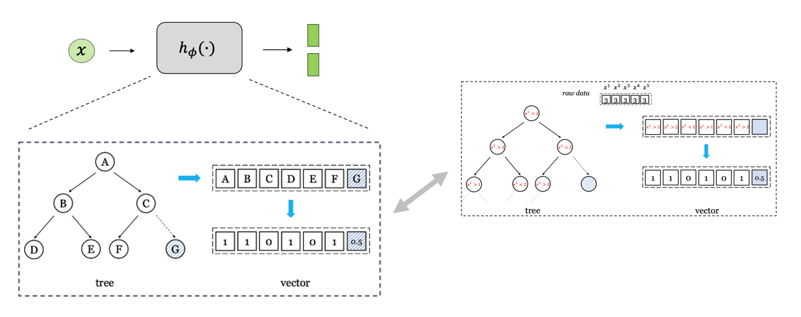
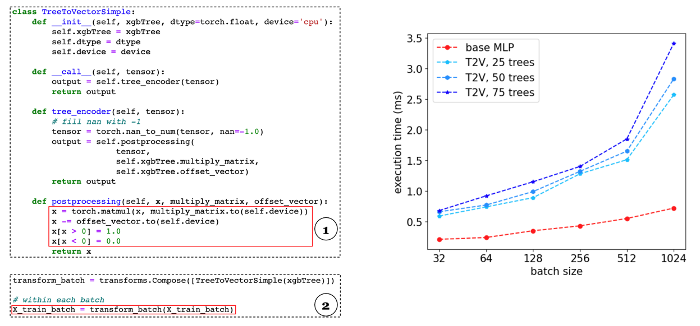

# Tree-Regularized Tabular Embeddings

This repository is the official implementation of [Tree-Regularized Tabular Embeddings](https://openreview.net/forum?id=dQLDxIPsU4), which utilizes the structure of pretrained tree ensembles to transform raw variables into a single vector (T2V), or an array of tokens (T2T). In essence,the transformed representations can be directly consumed by advanced tabular NN models with multi-layered perception (MLP) or multi-head attention (MHA) as building blocks. 

<p align="center">
  
<br>
<em>
convert tree to tokens
</em>
</p>

## Implementation 
We employ the transformation within each mini-batch to make it scalable for large tabular datasets with hundreds of columns and million of rows. For example, 

```python 
for _, (x, y) in enumerate(data_loader):
    # in-batch transformation
    x = transform_batch(x)
```

<p align="center">
  
<br>
</p>
